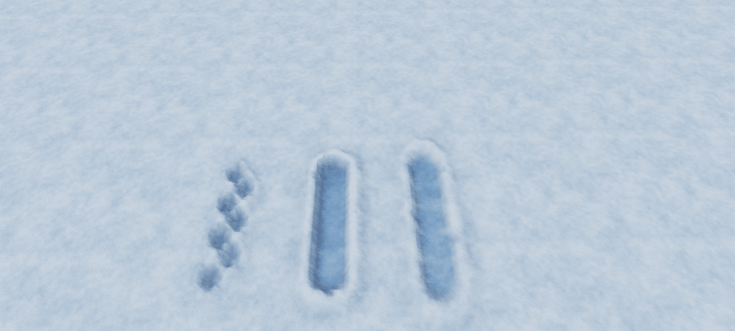

# Deformable Snow for O3DE

A C++ gem for deformable snow in Open 3D Engine. Footsteps, rolling objects and
ragdolls leave tracks in a procedural Atom mesh, with raised edges and gradual
snow recovery.



## Features

- Three stamp shapes: footsteps, rolling objects and ragdolls.
- A bundled **Snow Interactor** component for moving entities, with no project dependency.
- Distance-based alternating feet, continuous tracks, two-foot landings and teleport handling.
- Configurable grid size, snow height, track lifetime, recovery duration and update rate.
- A **Material** asset picker with a bundled powder snow material and textures.
- C++ and Lua gameplay APIs, with a standalone Lua demonstration.
- Per-surface simulation and GPU buffers; no network transport or authority mode.
- Editor and viewport component icons inspired by O3DE's component icon style.

The default surface is 42 x 34 metres with 337 x 273 vertices, 12.5 cm spacing and
a snow height of 18 cm above the entity origin. The default update rate is 20 Hz.

## Quick demo

1. Add a **Lua Script** component to the same entity as **Deformable Snow**.
2. Select [SnowDemo.lua](Assets/Scripts/DeformableSnow/SnowDemo.lua).
3. Leave **SnowSurface** empty to use the same entity, then enter game mode.

The script draws three animated lanes, waits for natural recovery, then repeats.
It clears the field only at startup. It needs no character,
physics actors or project-specific interactor. Use an illuminated level and place
the camera above the snow to see the tracks.

For gameplay, add **Snow Interactor** to your moving entity and select its
**Snow surface**. Choose a track type, radius and local contact offset (feet,
object bottom or pelvis). With **Require ground contact** enabled, a physics
ground collider is required; the support ray ignores the source body's collider.
Disable that option for scripted movement without physics. Both components are
provided by this gem. Animation and physics code can also use the contact API.

## Material

The default material is [Snow.material](Assets/Materials/Snow/Snow.material).
It uses StandardPBR, roughness 0.92, vertex colors for compaction and raised banks,
and the bundled albedo and normal maps in [Assets/Textures/Snow](Assets/Textures/Snow).
Choose another material with the component's **Material** asset picker. The
compiled default asset path is `materials/snow/snow.azmaterial`.

## Gameplay API

Include `<DeformableSnow/SnowSurfaceBus.h>` and depend on `Gem::DeformableSnow.API`.
Call the API on the main thread. Positions and radii are in world metres; yaw is
in world radians. Translation, rotation and uniform scale are supported.

```cpp
DeformableSnow::SnowSurfaceRequestBus::Event(
    surfaceId,
    &DeformableSnow::SnowSurfaceRequests::Stamp,
    worldContact, AZ::u32(0), 0.36f, yawRadians);
```

```lua
SnowSurfaceRequestBus.Event.Stamp(surfaceId, worldContact, 0, 0.36, yawRadians)
```

| Kind | Shape | Maximum depth |
| --- | --- | --- |
| `0` | Footstep | 12 cm |
| `1` | Rolling object | 16 cm |
| `2` | Ragdoll | 14 cm |

Use `SubmitContact` for spacing, alternating feet and continuous tracks. Send
`supported=false` when airborne and call `ForgetContact` when a source disappears.
`Clear` resets the surface. `GetHeight` samples its local Z height and returns world
Z, or NaN outside its bounds. It is not a world-vertical raycast against tilted snow.

By default a track lives for **10 seconds**, holding its shape for 8 seconds and
smoothly returning to the original surface during the final **2 seconds**.
**Track lifetime** includes **Recovery seconds**. Setting Recovery seconds to zero
keeps tracks indefinitely. Recovery updates only cells with an active imprint;
expired cells leave the recovery list, and idle surfaces stop uploading buffers.
Raised snow does not fill an existing trench. The C++ core additionally provides
snapshots and ordered event replay for local state restoration.

## Limitations

- Snow is visual geometry. The deforming mesh is not a collision mesh.
- Non-uniform scale, terrain streaming and GPU compute simulation are not supported.
- CPU and upload cost increase with grid size. The 1025 x 1025 limit is not a
  real-time performance guarantee.
- Rendering uses rasterized Atom meshes with staged updates to device-local
  input-assembly buffers. Ray tracing is disabled for the snow surface.
- Snapshots and replay are in-memory APIs, not network replication or disk persistence.

## License

[MIT](LICENSE).
